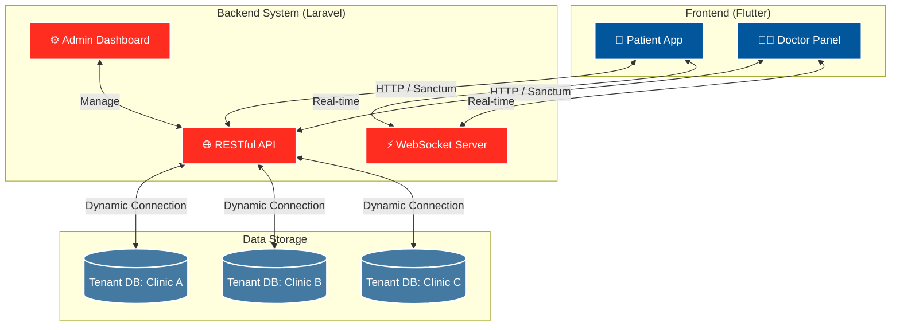

<div align="center">
  
  
  
  
  <h1>🏥 Medical ERP & Telehealth SaaS</h1>
  <p><strong>A Next-Generation Multi-Tenant Healthcare Solution</strong></p>

  <!-- Badges -->
  <p>
    
    
    
    
    
    
  </p>

  <p>
    <a href="#-architecture">Architecture</a> •
    <a href="#-features">Features</a> •
    <a href="#-getting-started">Getting Started</a>
  </p>
</div>

---

## 🌟 Overview

This project is a high-performance **Healthcare SaaS and ERP platform** built with **Flutter** (Frontend) and **Laravel** (Backend API). It is designed to modernize clinic operations, enhance patient-doctor communication, and provide absolute data security through an advanced **Database-per-Tenant** architecture.

---

## ✨ Features

- **🛡️ Multi-Tenant Architecture:** Total data isolation with a dynamic "Database per Tenant" approach, ensuring the highest level of security and API performance.
- **👨‍⚕️ Doctor & Patient Portals:** Dedicated UI/UX for both patients (booking, medical records) and healthcare providers (schedule management, consultations).
- **💬 Real-Time Chat & Telehealth:** Integrated instant messaging using WebSockets and real-time medical consultations via Video Calls.
- **📁 Digital Medical Records (EMR):** Secure, structured, and easily accessible patient history and prescriptions.
- **⚙️ Admin Dashboard (Livewire):** Powerful backend administration panel to manage clinics, profiles, subscriptions, and system metrics.

---

# Project Architecture Documentation

## Comprehensive Architecture Diagrams

### System Architecture
The system follows a strict Clean Architecture pattern on the frontend, decoupling presentation, domain, and data layers. The backend utilizes Laravel to securely hand-off requests to the appropriate tenant database.


### High-Level System Design



### Data Flow
- Explanation of how data moves through the system.
- Key data sources and sinks.


### User Flow
- Description of the user journey through the application.
- Key user interactions and use cases.


### Database Schema
- Overview of the database structure.
- Explanation of key tables, relationships, and specifications.


### Security Layers
- Description of the security architecture.
- Layers of security mechanisms designed to protect data and resources.


---

## 📱 Screenshots

> *(Add screenshots of your brilliant UI here)*

| Patient Dashboard | Doctor Appointments | Real-Time Chat | Telehealth Video |
| :---: | :---: | :---: | :---: |
|  |  |  |  |

---

## 🚀 Getting Started

### Prerequisites

- **Flutter SDK** (`>= 3.0.0`)
- **PHP** (`>= 8.2`) & **Composer**
- **MySQL / PostgreSQL** (for Tenant databases)
- **Node.js** & **NPM** (for WebSockets/Broadcasting, if local)

### Backend Setup (Laravel)

1. **Clone & Navigate:**
   ```bash
   cd backend
   ```
2. **Install Dependencies:**
   ```bash
   composer install
   npm install
   ```
3. **Environment setup:**
   ```bash
   cp .env.example .env
   php artisan key:generate
   ```
4. **Database & Migrations:**
   *Set up a central DB in `.env`, then run migrations for the main and tenant databases.*
   ```bash
   php artisan migrate --seed
   ```
5. **Serve Application:**
   ```bash
   php artisan serve
   ```

### Frontend Setup (Flutter)

1. **Navigate to Frontend:**
   ```bash
   cd frontend
   ```
2. **Get Dependencies:**
   ```bash
   flutter pub get
   ```
3. **Configure API:**
   Ensure `lib/core/constants/api_constants.dart` points to your local or deployed backend IP.
4. **Run the App:**
   ```bash
   flutter run
   ```

---

## 🤝 Contributing

Contributions, issues, and feature requests are welcome!  
Feel free to check [issues page](#).

## 📄 License

This project is licensed under the [MIT License](LICENSE).

---
<div align="center">
  <b>Built with ❤️ by Yassino</b>
</div>
