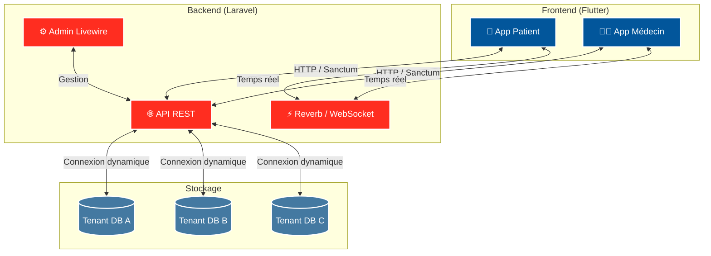

<div align="center">
  
  
  <h1>🏥 ERP Médical & SaaS de Télésanté</h1>
  <p><strong>Solution de santé multi-tenant nouvelle génération</strong></p>
  <p>
    
    
    
    
    
    
  </p>
  <p>
    <a href="#-aperçu">Aperçu</a> •
    <a href="#-fonctionnalités">Fonctionnalités</a> •
    <a href="#-démarrage-rapide">Démarrage rapide</a> •
    <a href="#-référentiel-des-commandes">Commandes</a>
  </p>
</div>

---

## 🌟 Aperçu

Ce projet est une plateforme **SaaS / ERP Santé** performante, composée d’un **frontend Flutter** (mobile) et d’un **backend Laravel** (API REST + temps réel).  
L’architecture repose sur une stratégie **Database per Tenant** pour isoler strictement les données des cliniques et renforcer la sécurité.

---

## ✨ Fonctionnalités

- **🛡️ Multi-tenant:** isolation forte des données via base de données dédiée par tenant.
- **👨‍⚕️ Portails patient / médecin:** parcours différenciés pour la prise de RDV, la consultation et la gestion clinique.
- **💬 Temps réel:** messagerie instantanée et visioconsultation (WebSockets / WebRTC).
- **📁 Dossier médical numérique:** historique médical structuré, stockage sécurisé et accès contrôlé.
- **⚙️ Administration:** interface d’administration backend (Livewire) et métriques d’exploitation.

---

## 🧱 Architecture

### Vue système



### Architecture applicative

- **Frontend:** Clean Architecture (présentation, domaine, données) dans `frontend/lib`.
- **Backend:** Laravel 11 (API, jobs, notifications, sécurité, tenancy).
- **Infra locale:** Docker Compose (Nginx, App, Queue, Scheduler, Reverb, PostgreSQL, Redis, Mailpit, MinIO, Coturn).

---

## 🎨 Maquettes Figma

> Aperçu des écrans UI/UX principaux pour les parcours patient et médecin.

| Dashboard Patient | Agenda Médecin | Chat Patient-Médecin | Visioconsultation |
| :---: | :---: | :---: | :---: |
| <a href="Figma/Dashboard Patient (V2.0).png"></a> | <a href="Figma/Agenda Médecin (V2.0).png"></a> | <a href="Figma/Chat Patient-Médecin (V2.0).png"></a> | <a href="Figma/Visioconsultation (V2.0).png"></a> |

---

## 🚀 Démarrage rapide

### Prérequis

- Flutter SDK `>= 3.6`
- PHP `>= 8.3`, Composer 2
- Node.js + npm
- Docker + Docker Compose

### Option 1 — Environnement local complet (recommandé)

Depuis la racine du projet :

```bash
make local-up
make local-health
```

Arrêt / nettoyage :

```bash
make local-down
make local-clean
```

### Option 2 — Démarrage manuel backend + frontend

Backend :

```bash
cd backend
composer install
npm install
cp .env.example .env
php artisan key:generate
php artisan migrate --seed
php artisan serve
```

Frontend :

```bash
cd frontend
flutter pub get
flutter run
```

Assurez-vous que l’URL API est correcte dans `frontend/lib/core/constants/api_constants.dart`.

---

## 🧰 Référentiel des commandes

### Frontend (Flutter)

```bash
cd frontend
flutter pub get
flutter analyze
flutter test
dart format lib test
flutter run
flutter run -d chrome
flutter build apk --release
flutter build appbundle --release
flutter build web --release
flutter clean
```

### Backend (Laravel)

```bash
cd backend
composer install
npm install
php artisan key:generate
php artisan migrate
php artisan migrate --seed
php artisan db:seed
php artisan serve
php artisan queue:work
php artisan schedule:work
php artisan reverb:start
php artisan test
php artisan test --parallel
vendor/bin/pint --test
vendor/bin/phpstan analyse --memory-limit=1G
composer audit --locked
npm run format
npm run format:check
composer run dev
```

### Base de données (PostgreSQL)

Avec Docker Compose :

```bash
docker compose -f docker-compose.yml -f docker-compose.local.yml exec postgres psql -U mediconnect -d mediconnect
docker compose -f docker-compose.yml -f docker-compose.local.yml exec postgres pg_isready -U mediconnect -d mediconnect
docker compose -f docker-compose.yml -f docker-compose.local.yml exec postgres pg_dump -U mediconnect mediconnect > backup.sql
cat backup.sql | docker compose -f docker-compose.yml -f docker-compose.local.yml exec -T postgres psql -U mediconnect -d mediconnect
```

Avec Laravel :

```bash
cd backend
php artisan migrate:status
php artisan migrate:rollback
php artisan migrate:fresh --seed
```

### DevSecOps / Qualité / CI

Commandes locales racine :

```bash
make hooks-install
make quality-local
make local-test
make backend-test-docker
make frontend-test
docker compose -f docker-compose.yml -f docker-compose.local.yml config -q
docker compose -f docker-compose.yml -f docker-compose.prod.yml config -q
./scripts/dev/check-staged-secrets.sh
```

Scans sécurité (mêmes outils que CI) :

```bash
docker run --rm -v "${PWD}:/repo" zricethezav/gitleaks:latest detect --source=/repo --no-git --redact --exit-code 1
docker run --rm -v /var/run/docker.sock:/var/run/docker.sock aquasec/trivy image --severity CRITICAL,HIGH --exit-code 1 <image:tag>
```

Déploiement Helm (exemple) :

```bash
helm upgrade --install mediconnect-staging ./helm-chart \
  --namespace mediconnect-staging \
  --create-namespace \
  --set image.repository=<registry/image> \
  --set image.tag=<tag> \
  --values ./helm-chart/values.yaml \
  --atomic --timeout 5m
```

---

## 🤝 Contribution

Les contributions, issues et suggestions sont les bienvenues.

## 📄 Licence

Ce projet est distribué sous licence [MIT](LICENSE).

---

<div align="center">
  <b>Built with ❤️ by Yassino X Chayma Mkaouar</b>
</div>
